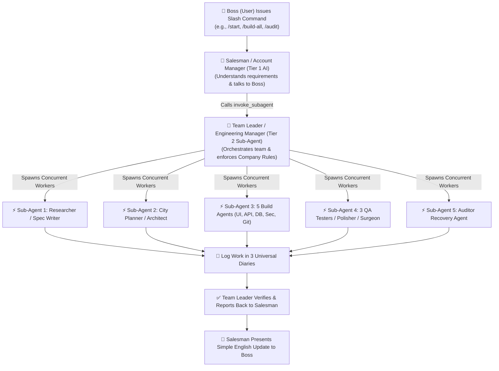

# Antigravity 2.0 Enterprise Ecosystem (`skills_bundle_by_sujal`)

Welcome to the official **Antigravity 2.0 Enterprise Ecosystem** created by Sujal! This package transforms your AI into a **3-Tier Multi-Agent Software Corporation** powered by native sub-agent invocation (`invoke_subagent`).

---

## The 3-Tier Enterprise Architecture

---

## How It Works (No Manual Sub-Agent Commands Required!)

You (the Boss) do **NOT** need to type `invoke_subagent`, `define_subagent`, or `/team-preview` manually! 

You simply type simple slash commands (e.g. `/start`, `/research`, `/spec`, `/architecture`, `/document`, `/build-all`, `/qa-test`, `/polish`, `/surgical`, `/audit`, `/context-save`). 

Behind the scenes:
1. The **Salesman AI (Tier 1)** greets you, clarifies your vision, and receives your command.
2. The skill file automatically executes the native `invoke_subagent` tool call to spawn the **Team Leader Sub-Agent (Tier 2)**.
3. The Team Leader automatically dispatches specialized **Worker Sub-Agents (Tier 3)** in background threads to execute the task concurrently.
4. All workers follow strict **Company Rules** (`AGENTS.md`) and log work in the **3 Universal Diaries**.
5. The Team Leader checks the code and hands the clean report back to the Salesman, who presents a simple English summary to you!

---

## Command Reference & Sub-Agent Map

| Command | Dispatched Sub-Agents | Responsibilities |
| :--- | :--- | :--- |
| **`/start`** | Team Leader Sub-Agent | Greets the Boss, sets up the 3 workspace folders and 3 blank diaries. |
| **`/research`** | Researcher Sub-Agent | Compulsory live web search for market competitors, APIs, and hardware protocols. |
| **`/spec`** | Spec Writer Sub-Agent | Detects local skills, asks for permission, generates `master_spec.md` with word-breakdown UI/math. Enforces immutable `_v2.md` versioning. |
| **`/architecture`** | City Planner & Office Manager Sub-Agents | 3-Step city mapping (`system_architecture.md`), strict coding rules (`agents.md`), and step-by-step master checklist (`tasks.md`). |
| **`/document`** | Documentarian Architecture Sub-Agent | Generates all 7 Compulsory Documents (PRD, APIs, DB Schema, UI/UX, Hardware, Security, QA). |
| **`/build-all`** | **5 Concurrent Sub-Agents** (Front-End, Backend, DB, Security, GitHub Saver) | Runs true parallel background coding for UI, APIs, DB models, JWT auth, `.env` templates, and commit logs. |
| **`/qa-test`** | **3 Concurrent Sub-Agents** (Spell Checker, Math Checker, Human Simulator) | Syntax check, math verification, browser click flow. Enforces the **3 Paths Rule** for bug resolution. |
| **`/polish`** | Polisher Sub-Agent | UX sweep for button hover states, animations, mobile responsiveness. Reports cuts to Surgeon. |
| **`/surgical`** | Surgeon Sub-Agent | Pre-Change Insurance Protocol (backs up file to folder 3 first), impact analysis, and precision code edit. |
| **`/audit`** | Auditor Recovery Sub-Agent | Multi-angle reverse engineering for pre-built or broken projects. Asks Boss about dream vision and rebuilds seamlessly. |
| **`/context-save`** | Memory Keeper Sub-Agent | Compresses all chats, files, plans, and diaries into a complete context snapshot. |
| **`/context-load`** | Memory Keeper Sub-Agent | Restores workspace context perfectly for new sessions. |

---

## Core Protection Safeguards
- **100% Compulsory 7 Documents**: All 7 blueprints are generated for every app regardless of scale.
- **Pre-Change Surgical Insurance**: Files are backed up before any code modification.
- **Immutable Spec Locks**: Document updates spawn `_v2.md` with numbered changelogs (1, 2, 3...) instead of overwriting.
- **Company Rule Governance**: Every sub-agent is strictly bound to `AGENTS.md` and `.gemini`.

---

## Installation

1. Copy `.gemini` to your user home directory or project root.
2. Place `AGENTS.md` and the `skills/` folder in your workspace root.
3. Open your terminal or AI interface and type `/start`. Welcome to your 3-Tier Multi-Agent Software Corporation!
