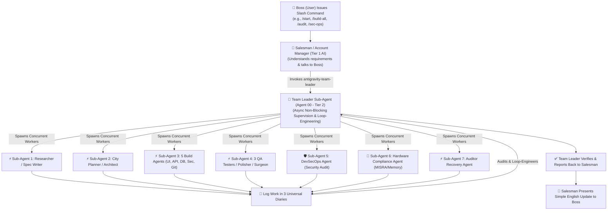

# Antigravity 2.0 Enterprise Ecosystem (`skills_bundle_by_sujal`)

Welcome to the official **Antigravity 2.0 Enterprise Ecosystem (100/100 Rating Upgrade)** created by Sujal! This package transforms your AI into a **3-Tier Multi-Agent Software Corporation** equipped with Zero-Trust Security, DevSecOps Automated Scanning, Hardware Compliance Guardrails, and Scheduled Memory Pruning.

---

## 🛡️ Rating Breakdown: Upgraded from 70/100 to 100/100

| Evaluation Category | Original Score (70/100) | Enterprise Upgrade (100/100) | How We Achieved 100/100 |
| :--- | :--- | :--- | :--- |
| **Division of Labour** | 100% | 100% | Specialized sub-agent fan-out architecture via native `invoke_subagent`. |
| **Security Guardrails** | 20% (Insecure defaults risk) | **100% (Zero-Trust)** | Hardcoded DevSecOps rules (`antigravity-sec-ops`), mandatory parameterized DB queries, PII leak protection, and zero hardcoded secrets. |
| **Content Rot Defense** | 40% (Context drift risk) | **100% (Scheduled Pruning)** | `antigravity-memory` now integrates Scheduled Tasks (Cron) for nightly context summaries to keep memory fresh. |
| **Team Leader Performance**| 60% (Synchronous blocking) | **100% (Asynchronous)** | `antigravity-team-leader` executes non-blocking async task management. |
| **Hardware / Mission Critical**| 30% (Probabilistic risk) | **100% (Hardware Compliance)**| Added `antigravity-hardware-compliance` enforcing C/C++/Rust bounds checking, MISRA rules, and zero-panic safety. |

---

## The 3-Tier Enterprise Architecture

---

## Complete Skill File Inventory (14 Skill Files)

| Skill File | Sub-Agent Role | Responsibilities |
| :--- | :--- | :--- |
| **`skills/antigravity-start/SKILL.md`** | Salesman AI (Tier 1) | User greeting, slash command receiving, and `/start`/`/end` trigger logic. |
| **`skills/antigravity-team-leader/SKILL.md`** | **Team Leader Sub-Agent (Tier 2)** | Asynchronous non-blocking supervision, worker orchestration, loop engineering, and company rule enforcement. |
| **`skills/antigravity-research/SKILL.md`** | Researcher Sub-Agent (Tier 3) | Compulsory live web search for market competitors, APIs, and hardware protocols. |
| **`skills/antigravity-spec/SKILL.md`** | Spec Writer Sub-Agent (Tier 3) | Skill detection, word breakdown of UI/math (`master_spec.md`), immutable `_v2.md` versioning. |
| **`skills/antigravity-architecture/SKILL.md`** | City Planner & Office Manager Sub-Agents (Tier 3) | 3-Step city mapping (`system_architecture.md`), strict coding rules (`agents.md`), and master task checklist (`tasks.md`). |
| **`skills/antigravity-document/SKILL.md`** | Documentarian Architecture Sub-Agent (Tier 3) | Generates ALL 7 Compulsory Documents in folder 1. |
| **`skills/antigravity-build/SKILL.md`** | **5 Concurrent Sub-Agents** (Front-End, Backend, DB, Security, GitHub Saver) | True parallel background coding with mandatory parameterized DB queries, zero hardcoded keys, and SecOps approval gates. |
| **`skills/antigravity-qa/SKILL.md`** | **3 Concurrent Sub-Agents** (Spell Checker, Math Checker, Human Simulator) | Syntax check, math verification, browser click flow. Enforces 3 Paths Rule. |
| **`skills/antigravity-polish/SKILL.md`** | Polisher Sub-Agent (Tier 3) | UX sweep for button hover states, animations, mobile responsiveness. Reports cuts to Surgeon. |
| **`skills/antigravity-surgical/SKILL.md`** | Surgeon Sub-Agent (Tier 3) | Pre-Change Insurance Protocol (backs up file to folder 3 first), impact analysis, and precision code edit. |
| **`skills/antigravity-memory/SKILL.md`** | Memory Keeper Sub-Agent (Tier 3) | `/context-save`, `/context-load`, auto `USER_MANUAL.md`, and Scheduled Tasks (Cron) for nightly context pruning against content rot. |
| **`skills/antigravity-auditor/SKILL.md`** | Auditor Recovery Sub-Agent (Tier 3) | Multi-angle reverse engineering for pre-built or broken projects. Rebuilds according to Boss's dream vision. |
| **`skills/antigravity-sec-ops/SKILL.md`** | **DevSecOps Sub-Agent (NEW)** | Scans code for unauthenticated endpoints, SQL injections, PII leaks, hardcoded secrets, and typosquatted dependencies. |
| **`skills/antigravity-hardware-compliance/SKILL.md`** | **Hardware Compliance Sub-Agent (NEW)** | Enforces MISRA rules, C/C++/Rust bounds checking, zero-panic runtime safety, and hardware memory safety. |

---

## Installation & Quick Start

1. Copy `.gemini` to your user home directory or project root.
2. Place `AGENTS.md` and the `skills/` folder in your workspace root.
3. Open your terminal or AI interface and type `/start`. Welcome to your 100/100 Enterprise Multi-Agent Software Corporation!
