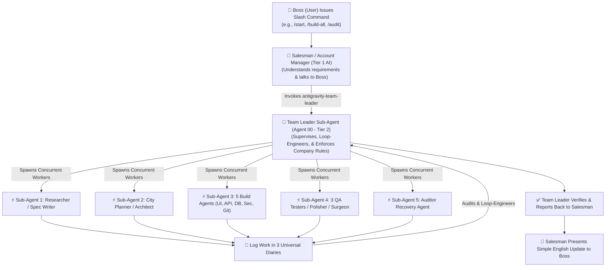

# Antigravity 2.0 Enterprise Ecosystem (`skills_bundle_by_sujal`)

Welcome to the official **Antigravity 2.0 Enterprise Ecosystem** created by Sujal! This package transforms your AI into a **3-Tier Multi-Agent Software Corporation** powered by native sub-agent invocation (`invoke_subagent`) and supervised by a dedicated **Team Leader Sub-Agent (`antigravity-team-leader`)**.

---

## The 3-Tier Enterprise Architecture

---

## How It Works (Dedicated Team Leader Integration)

You (the Boss) do **NOT** need to type `invoke_subagent` or manage sub-agents manually! 

You simply type standard slash commands (e.g. `/start`, `/research`, `/spec`, `/architecture`, `/document`, `/build-all`, `/qa-test`, `/polish`, `/surgical`, `/audit`, `/context-save`, `/end`). 

Behind the scenes:
1. The **Salesman AI (Tier 1)** greets you, clarifies your vision, and receives your command.
2. Upon `/start`, the Salesman AI automatically invokes **Agent 00 (The Team Leader Sub-Agent)** using its dedicated skill file: `skills/antigravity-team-leader/SKILL.md`.
3. The Team Leader Sub-Agent initializes workspace folders, sets up the 3 Universal Diaries, and maintains continuous **loop-engineering supervision** over all worker sub-agents.
4. If any worker sub-agent hallucinates or strays off path, the Team Leader Sub-Agent intervenes, re-prompts the sub-agent, and corrects the trajectory before reporting back.
5. Upon `/end`, the Team Leader Sub-Agent gracefully spins down worker sessions while preserving all files and diaries.

---

## Complete Skill File Inventory

| Skill File | Sub-Agent Role | Responsibilities |
| :--- | :--- | :--- |
| **`skills/antigravity-start/SKILL.md`** | Salesman AI (Tier 1) | User greeting, slash command receiving, and `/start`/`/end` trigger logic. |
| **`skills/antigravity-team-leader/SKILL.md`** | **Team Leader Sub-Agent (Agent 00 - Tier 2)** | Workspace setup, worker orchestration, loop engineering, supervision, and company rule enforcement. |
| **`skills/antigravity-research/SKILL.md`** | Researcher Sub-Agent (Tier 3) | Compulsory live web search for market competitors, APIs, and hardware protocols. |
| **`skills/antigravity-spec/SKILL.md`** | Spec Writer Sub-Agent (Tier 3) | Skill detection, word breakdown of UI/math (`master_spec.md`), immutable `_v2.md` versioning. |
| **`skills/antigravity-architecture/SKILL.md`** | City Planner & Office Manager Sub-Agents (Tier 3) | 3-Step city mapping (`system_architecture.md`), strict coding rules (`agents.md`), and master task checklist (`tasks.md`). |
| **`skills/antigravity-document/SKILL.md`** | Documentarian Architecture Sub-Agent (Tier 3) | Generates ALL 7 Compulsory Documents in folder 1. |
| **`skills/antigravity-build/SKILL.md`** | **5 Concurrent Sub-Agents** (Front-End, Backend, DB, Security, GitHub Saver) | True parallel background coding for UI, APIs, DB models, JWT auth, `.env` templates, and commit logs. |
| **`skills/antigravity-qa/SKILL.md`** | **3 Concurrent Sub-Agents** (Spell Checker, Math Checker, Human Simulator) | Syntax check, math verification, browser click flow. Enforces 3 Paths Rule. |
| **`skills/antigravity-polish/SKILL.md`** | Polisher Sub-Agent (Tier 3) | UX sweep for button hover states, animations, mobile responsiveness. Reports cuts to Surgeon. |
| **`skills/antigravity-surgical/SKILL.md`** | Surgeon Sub-Agent (Tier 3) | Pre-Change Insurance Protocol (backs up file to folder 3 first), impact analysis, and precision code edit. |
| **`skills/antigravity-memory/SKILL.md`** | Memory Keeper & User-Manual Sub-Agents (Tier 3) | `/context-save`, `/context-load`, and auto-generated `USER_MANUAL.md`. |
| **`skills/antigravity-auditor/SKILL.md`** | Auditor Recovery Sub-Agent (Tier 3) | Multi-angle reverse engineering for pre-built or broken projects. Rebuilds according to Boss's dream vision. |

---

## Core Protection Safeguards
- **Dedicated Team Leader Supervision**: Loop engineering ensures worker sub-agents never stray or hallucinate.
- **100% Compulsory 7 Documents**: All 7 blueprints are generated for every app regardless of scale.
- **Pre-Change Surgical Insurance**: Files are backed up before any code modification.
- **Immutable Spec Locks**: Document updates spawn `_v2.md` with numbered changelogs (1, 2, 3...) instead of overwriting.

---

## Installation

1. Copy `.gemini` to your user home directory or project root.
2. Place `AGENTS.md` and the `skills/` folder in your workspace root.
3. Open your terminal or AI interface and type `/start`. Welcome to your 3-Tier Multi-Agent Software Corporation!
